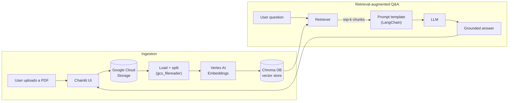

> **© 2026 Chiranjeev (@chiranr19) — All Rights Reserved.** This project is **source-available for viewing only**; it is *not* open source. No copying, reuse, modification, deployment, or redistribution of any part of it (or its underlying ideas) without prior written permission — see [LICENSE](./LICENSE) and [SIGNATURE](./SIGNATURE). Prospective employers and collaborators are welcome to read the code.  ·  authorship sigil `4DBH·QKSW·HGOW·3DHK`

# Chainlit · GCP · Vertex AI — RAG System

This repository contains code that enables users to upload files via a Chainlit interface, store those files in Google Cloud Storage (GCS), and leverage Vertex AI Embeddings and Chroma DB for retrieval-augmented generation (RAG). This allows users to ask questions related to the contents of the uploaded files.

## Architecture

Two paths: **ingestion** turns an uploaded PDF into searchable vectors;
**Q&A** retrieves the relevant chunks and grounds the LLM's answer in them.

## Key Components
Chainlit: Provides an interactive interface for users to upload files and interact with the system.
Google Cloud Storage (GCS): Used to store the uploaded files.
Vertex AI Embeddings: Embeds the contents of the files into vector representations for retrieval.
Chroma DB: A vector database used for storing and searching document embeddings.
Retrieval-Augmented Generation (RAG): Allows users to ask questions about the uploaded files and retrieves the most relevant information.
Features
File Upload: Users can upload a file (e.g., a PDF) through the Chainlit interface.
GCS Integration: The file is uploaded to a specified Google Cloud Storage bucket.
Vector Embeddings: The contents of the file are embedded using Google Vertex AI Embeddings and stored in Chroma DB.
RAG for Q&A: Users can ask questions, and the system retrieves relevant information from the uploaded file using Retrieval-Augmented Generation.
Prerequisites
Python 3.10+
Chainlit: An interactive chatbot interface.
Google Cloud SDK: Set up for accessing GCS and Vertex AI.
Chroma DB: A vector database.
OpenAI API: For natural language processing tasks.
